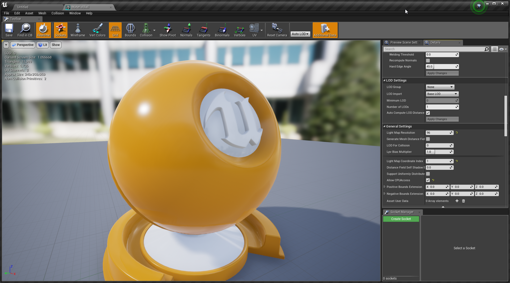
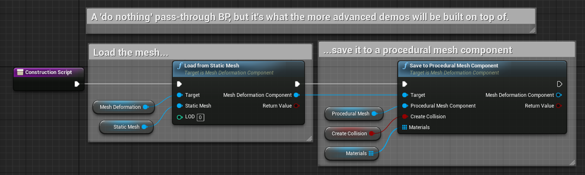

# Load From Static Mesh

This allows you to load the contents of a [Static Mesh](https://docs.unrealengine.com/latest/INT/Engine/Content/Types/StaticMeshes/) into a MeshDeformationComponent.

In order for this to work the mesh *must have 'Allow CPU Access'* checked as without this we're unable to access the vertices which it contains.  When you open a mesh this setting is available under 'General' in the Details pane, although you may have to expand the 'General' section to see it.

Details pane showing 'Allow CPU Access'

## Demo Scenes
This node is first introduced in *PassthroughDemo/Passthrough*, but is used in most of the demo scenes to load the initial geometry.

The Passthrough demo just loads some geometry and then renders it to a ProceduralMeshComponent.

Demo scene for Load From Static Mesh

The Blueprint for the demo
